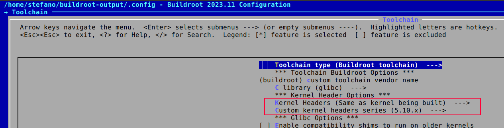

This is part one of a 2-post series dedicated to the packaging of the popular 3D printing stack [Klipper](https://www.klipper3d.org/) for Buildroot.

## TL;DR

Check out the Buildroot [config file](https://github.com/cooked/buildroot-ext/tree/master/configs).

## Overview

Klipper is a control firmware that takes a slightly different approach compared to others, splitting the workload between a SBC (typically less resource contrained), in charge of all the heavy load computation and a MCU board, tasked with the generation of the low-level signals to the actuator and from the sensors.
 

. It offloads computation to a separate computer (like a Raspberry Pi), resulting in faster printing times and higher accuracy. 
2. Moonraker acts as the web API gateway, connecting Klipper to the outside world. It provides APIs for remote control and monitoring.
3. Mainsail, on the other hand, is the sleek, responsive user interface designed specifically for Klipper. Accessible from anywhere, it offers features like file management, print history, and more


## Implementation

Klipper 3d installation is based on blabla bla... configuration uses kconfig bla bla bla

Describes the steps to the implementation with all the quirks


```bash
BR2_LINUX_KERNEL_INTREE_DTS_NAME="bcm2711-rpi-4-b"
```

```bash
arch/arm/boot/dts
```

In the end, I picked the [**stable_20211118**](https://github.com/raspberrypi/linux/tree/stable_20211118) tag of the Raspberry Pi Linux kernel.

What is still left to know at this point is what kernel version the selected tag will build. This information can be found in the main [Makefile](https://github.com/raspberrypi/linux/blob/stable_20211118/Makefile) which, for the given tag looks like

```bash
VERSION = 5
PATCHLEVEL = 10
SUBLEVEL = 63
```

**OLDER KERNEL** - In hindsight, the reason to roll back to an older stable tag is that I couldn't find a proper PREEMPT_RT patch for the later kernel that Buildroot was defaulting to. 
{: .notice--info}

### PREEMPT_RT patch source 

Once the kernel version is known, a proper PREEMPT_RT patch can be identified from the official list at [The Linux Foundation - PREEMPT_RT patch versions](https://wiki.linuxfoundation.org/realtime/preempt_rt_versions).

**MATCHING VERSION** - The ideal patch would have version, patchlevel and sublevel all matching. In my case **I was able to match only version and patchlevel**, then I picked the latest patch sublevel older than the kernel sublevel, and with a stable RT version (i.e., not rc, or release candidate), which points to [**5.10.59-rt52**](https://cdn.kernel.org/pub/linux/kernel/projects/rt/5.10/older/patch-5.10.59-rt52.patch.xz).
{: .notice--info}

```bash
# selected PREEMPT_RT patch
5.10.59-rt52
```

### Buildroot defconfig file

The following snippet shows the most important changes to the standard Raspberry Pi 4 defconfig file, to build the RT kernel. The complete defconfig file is available here.

```bash
# source kernel from Raspberry Pi GitHub (at an explicti tag)
BR2_LINUX_KERNEL_CUSTOM_GIT=y
BR2_LINUX_KERNEL_CUSTOM_REPO_URL="https://github.com/raspberrypi/linux.git"
BR2_LINUX_KERNEL_CUSTOM_REPO_VERSION="stable_20211118"

# point to a compatible patch version
BR2_LINUX_KERNEL_PATCH="https://cdn.kernel.org/pub/linux/kernel/projects/rt/5.10/older/patch-5.10.59-rt52.patch.xz"

# keep the RT flag in a fragment file, for modularity
BR2_LINUX_KERNEL_CONFIG_FRAGMENT_FILES="$(BR2_EXTERNAL)/board/raspberrypi-rt/linux.config"

# align the toolchain header files
BR2_PACKAGE_HOST_LINUX_HEADERS_CUSTOM_5_10=y
```

Keeping the RT flag in a separate file has the advantage that we don't have to issue the **make linux-menuconfig** command manually. Buildroot automatically applies the RT config flag, only after the kernel has been patched (i.e., only when the RT config flag is actually available, since before the patch it is not). The kernel fragment file is a one liner:

```bash
# enable full preemption
CONFIG_PREEMPT_RT=y
```

**BUILDROOT** - If you don't have Buildroot installed you can follow the setup steps (and a shortlist of useful commands) described in [Buildroot basics]({{ site.baseurl }}/buildroot_basics)
{: .notice--info}

[](../assets/img/buildroot-rpi/buildroot-rpi-kernel.png)

[](../assets/img/buildroot-rpi/buildroot-rpi-kernel-toolchain.png)

## References

- [SO - Where do I find the version of a Linux kernel source tree?](https://stackoverflow.com/a/12151781) 
- [SO - How to grep commits based on a certain string?](https://stackoverflow.com/questions/1337320/how-to-grep-commits-based-on-a-certain-string)
- [SO - How to find a commit by its hash?](https://stackoverflow.com/questions/14167335/how-to-find-a-commit-by-its-hash)
