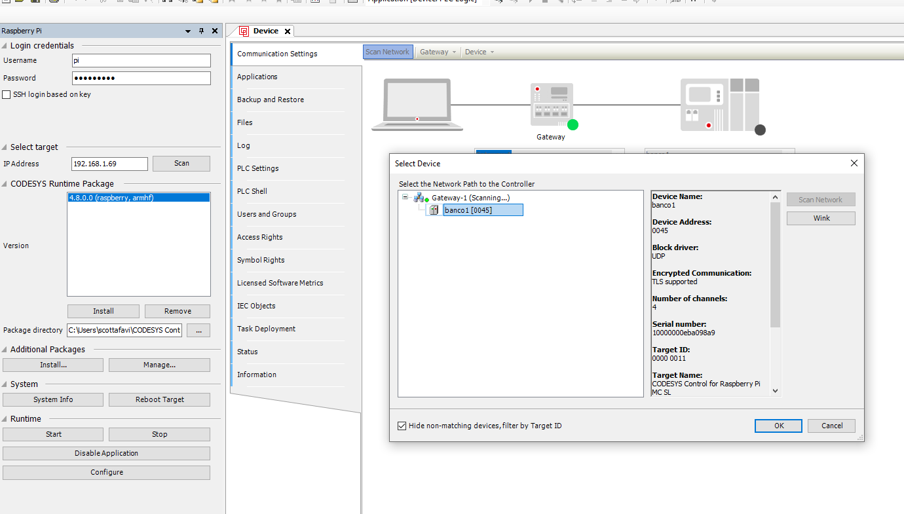
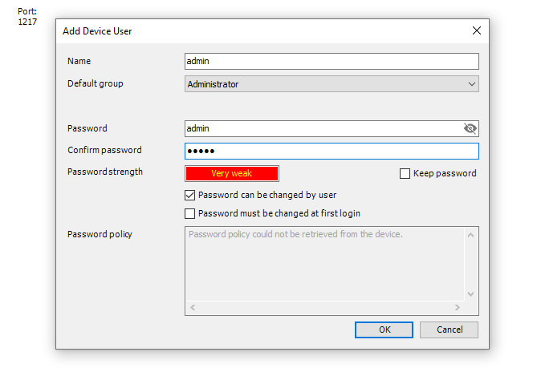
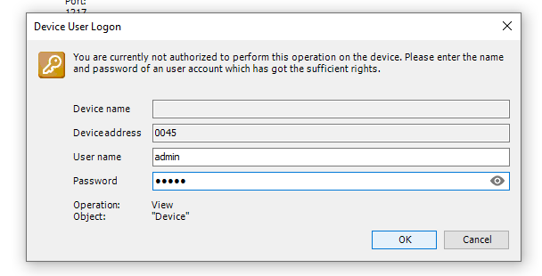
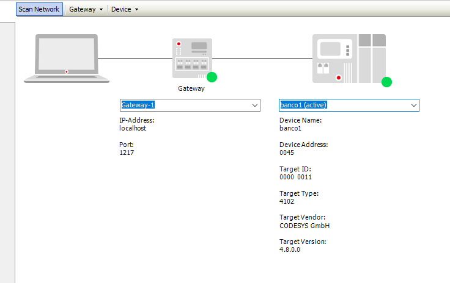
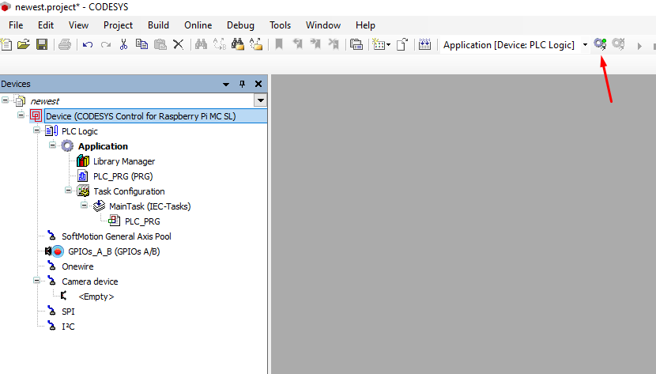
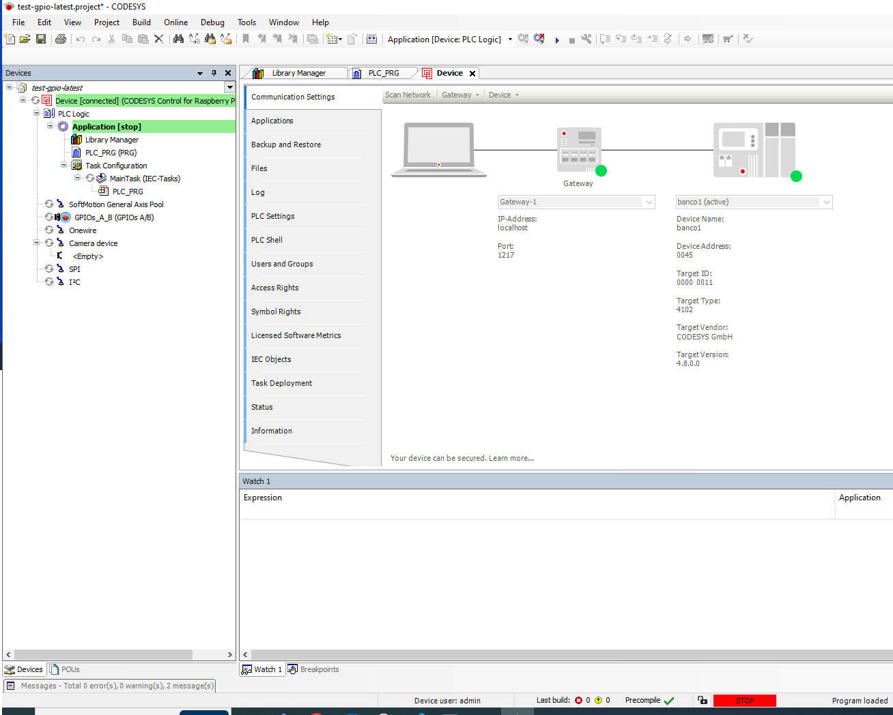

How to install and setup CODESYS soft PLC on the Raspberry Pi single-board computer.

## TL;DR

TODO:

## Prepare Raspberry Pi

### Flash SD

Flash a 32bit raspi OS (lite is ok, but stick to 32, do not use 64bit !!! )… 32bit OS is a requirements for the Control Raspberry MC SL

### Enable SSH

enable SSH as usual with the .ssh file in the boot partition

### Configure network

- set a static IP like 192.168.1.69 for the RPi and use a LAN cable to connect the dev PC (stay away from wifi and DHCP for now… to be investigated later)

```bash
# add the following / uncomment 
# sudo nano /etc/dhcpcd.conf

interface wlan0 (or eth0 or whatever)
static_routers=192.168.1.1
static domain_name_servers=192.168.1.1
static ip_address=192.168.1.69/24
```

- https://faq.codesys.com/pages/viewpage.action?pageId=153321520

### Bug / Fix

SSH to the RPi and modify the **/boot/config.txt** as follows (https://forge.codesys.com/forge/talk/Engineering/thread/510303ceaa/#464c)

```bash
arm_64bit=0
```

failing to do so will trigger a bug where the RTE does not detect the OS as 32bit even though it is ….. 

**[ERROR] Architecture seems to be arm64. CODESYS Control for Raspberry Pi SL is only available on the 32-bit kernel for Raspberry Pi!**

RESTART raspberry??

## CODESYS IDE

CODESYS IDE requires a Windows machine to run.

- installed 3.5.19.10 (note that first it adds the CODESYS Installer and then use it for all the other packages)
- with the IDE in place, via the Installer add the CODESYS Control for Raspberry MC SL

### Configure PC network

make sure the ethernet port on the dev PC is configured to be some 192.168.1.1 or similar on the same subnet of the rpi (get to the dialog box shown below… changing to Manual IP from elsewhere might not work properly)


### Flash RTE

flash the 4.8.0 RTE… select multicore

then try to scan to find it



for now the authentication by the user is mandatory so setup  admin/admin credential for privileged user

(TODO consider disabling it https://faq.codesys.com/pages/viewpage.action?pageId=115834919)



then go on with the login….(it asks twice)



finally



then go on and login



and again with app compiled and deployed



### Authentication

TODO: describe the many levels of codesys authentications...

### SSH Autentication

Setting up SSH keys for CODESYS development will save the coder from manually login each time he needs to deploy an artifact (i.e. connect to the Raspberry Pi)

https://help.codesys.com/webapp/_rbp_connect_with_public_key_authentication;product=CODESYS_Control_for_Raspberry_Pi_SL;version=4.2.0.0#id1

TL;DR: https://help.codesys.com/webapp/_rbp_connect_with_public_key_authentication;product=CODESYS_Control_for_Raspberry_Pi_SL;version=4.2.0.0#copying-the-public-key-to-the-controller


Start generate the ssh key on the dev pc (either win or linux)… the use the following to set them as authorized keys on the server

```bash
# -i specifies the (public) key you want to push to the server (remote), the rest is the
# usual login to the your remoter 
ssh-copy-id -i ~/.ssh/id_rsa.pub pi@192.168.1.69
```

ssh keys are added on the server to the same .ssh/authorize_keys file 

- update (or uncomment lines) the sshd config file to allow for auth key access (and optionally disable completely the ssh access with password)… ref to https://www.geekyhacker.com/configure-ssh-key-based-authentication-on-raspberry-pi/ with some additions

```bash
PermitRootLogin no
PasswordAuthentication no # yes, if you want allow "ssh" pwd access (local pwd is always possible)
PubkeyAuthentication yes    
AuthorizedKeysFile .ssh/authorized_keys
ChallengeResponseAuthentication no
UsePAM no
```

restart the service after the changes

```bash
sudo systemctl reload sshd
```


### Autorestart via cronjob

Without a valid license, the CODESYS RTE will run for 2 hours then stop. Assuming the application and/or process you're running is not impacted by it (e.g., simple mockups and lab setups) 
a cron job can be configured to periodically restart the CODESYS service (below we do it every hour).
Cron job is active immediately, with no need to restart cron. Note that we use sudo to edit the **root** cron table, and not the user cron table.

```bash
sudo crontab -e
*/60 * * * * /usr/sbin/service codesyscontrol restart
```

To check the job runs correctly use **top** to check the PID of the codesysruntime.service is changed every hour.


## TODOs and Further development

Few ideas I'd like to experiment with in the future are:

TODO:

## References

Here's a list of some of the references used throughout this project:

- Ref 1 [link]()
- Ref 2 [GitHub repository]()
