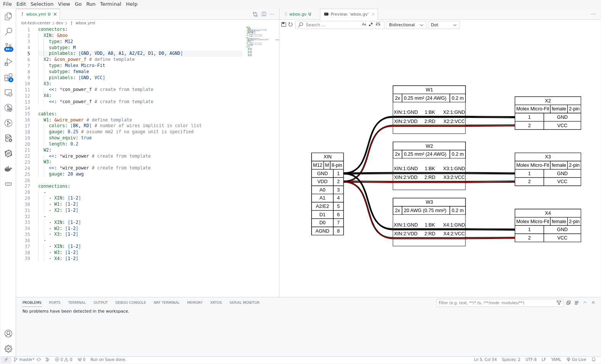

This post shows how to setup WireViz and VSCode to write electric cables with graphical live preview inside the editor. 

## Setup

WireViz requires [Python 3](https://www.python.org/) and [Graphviz](https://graphviz.org/).

### WireViz

As the summary page says, [WireViz](https://github.com/wireviz/WireViz) is a tool for documenting cables, wiring harnesses and connector pinouts. It takes a structured input file (YAML) describing the cable features and produces a graphical representation of the cable (image file), and its BOM (CSV file).

Install WireViz running the following command:

```bash
pip3 install wireviz
```

### VSCode

[VSCode](https://code.visualstudio.com/) is a good place to start editing the WireViz YAML input files, as it comes with sintax highlighting for that language. 

Additionally, install a couple of extensions to automate the steps of the workflow a bit, which is:

- to **run WireViz automatically**, every time an input file is saved. For that, we install the [Run On Save extension](https://marketplace.visualstudio.com/items?itemName=emeraldwalk.RunOnSave), that allows to run a certain command, when the editor file that is saved matches a certain pattern (e.g. the *.yml file extension of the WireViz input file). Configure the extension adding the following snippet to the workspace settings:

```json
"settings": {
    "emeraldwalk.runonsave": {
        "commands": [
            {
                "match": "\\.yml$",
                "cmd": "wireviz ${file}"
            },
            
        ]
    }
}
```

- to **show a live-updated** graphical representation of the cable, using the [Graphviz Interactive Preview](https://marketplace.visualstudio.com/items?itemName=tintinweb.graphviz-interactive-preview). The extension adds an editor tab that contains the rendered image of the .gv (graphviz) file which, in our case, is generated automatically as a byproduct of the previous WireViz run.  


## Example

A VSCode code editor tab layout that worked for me is to have the YAML input file open on the left and the Graphviz preview on the right, on top of the .gv source.   

**NOTE** : the first time saving the YAML file, the Graphviz source and Preview must be opened manually since they don't exist yet. Updating and saving the YAML file afterwards wil trigger the automated workflow and the preview updates live (unless the input file contains errors and is not processed successfully by WireViz).



## References

Here's a list of some of the references used throughout this project:

- WireViz [tutorial](https://github.com/wireviz/WireViz/blob/master/tutorial/readme.md)
- WireViz [examples](https://github.com/wireviz/WireViz/tree/master/examples)
