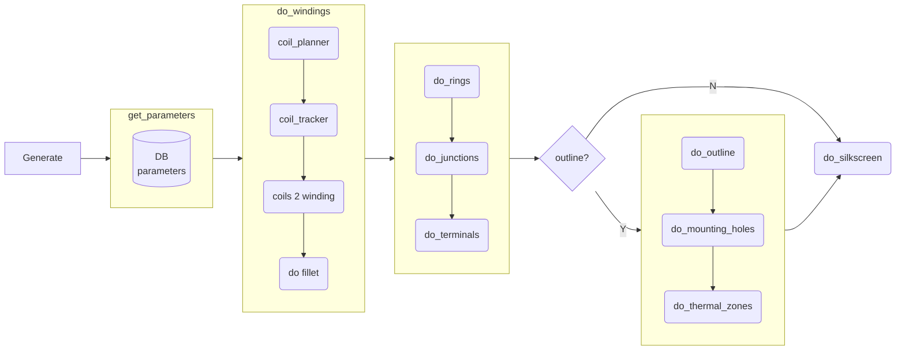
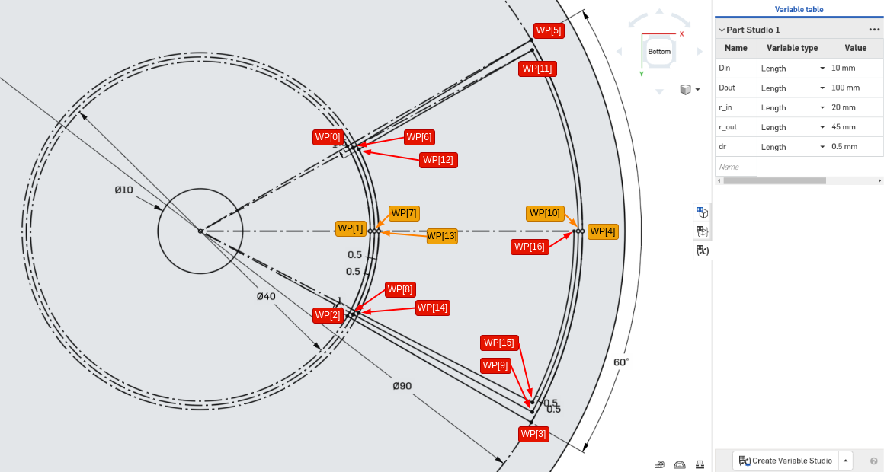
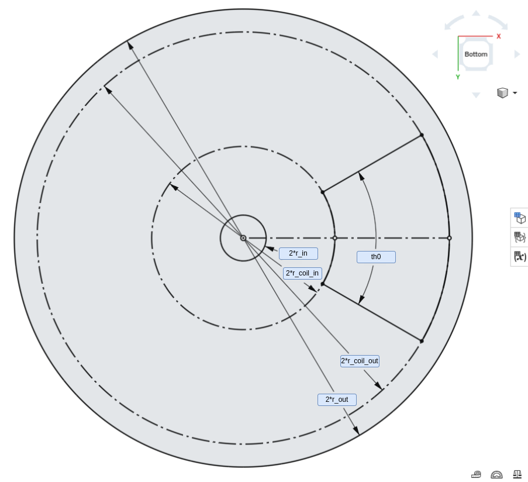
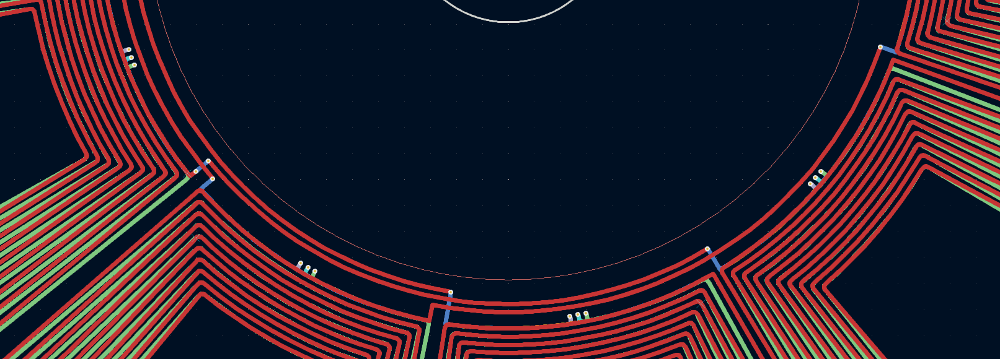
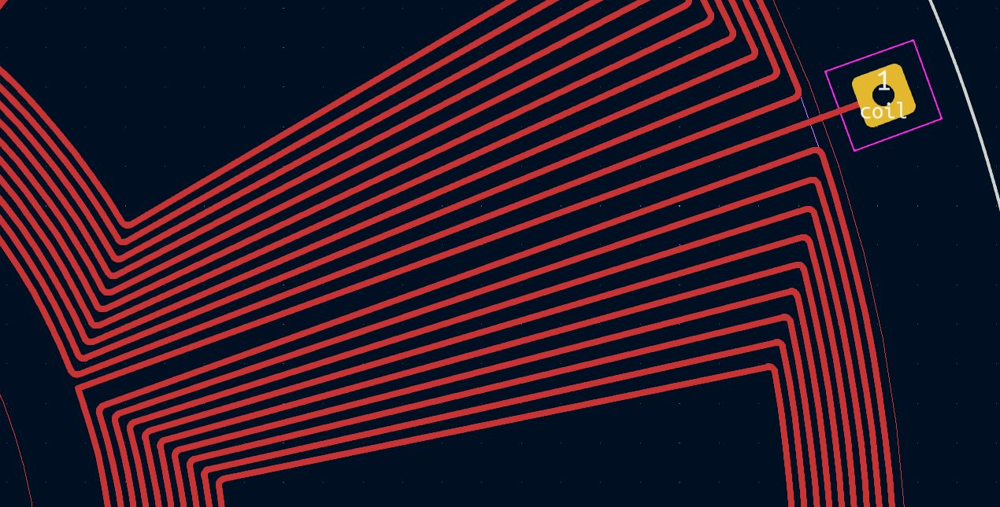

KiMotor plugin explained from a developer's point of view

## Overview

[KiMotor](https://github.com/cooked/kimotor) automates the design of PCB motors. The process is controlled by a set of parameters that a user can provide via a [wxPython](https://wxpython.org/index.html) GUI, designed with [wxformbuilder](https://github.com/wxFormBuilder/wxFormBuilder). The parameters describe the features of the PCB motor that are created according to the following workflow:

## Definitions

### Terminology

TODO: add picture

|         |   |
| :---------- | :----------|
| **slot**    | Conventional motor's slots are mechanical features of the stator, resembling teeth, which allow for the motor windings to be wound onto. In a KiMotor PCB, the slot is the way the "active" area of the stator is partitioned (it spans an angle of *2\*pi/n_slots*) |
| **coil**    | Series of turns made up of PCB tracks, either straight lines or arcs, all contained onto a single PCB layer |
| **winding** | Motor windings are loops of copper wire, packed together to achieve high copper density for a given volume (around one or more motor slot). In KiMotor a winding is a multi-layer stack of coils. The current version of KiMotor only supports concentrated windings, so each winding is fully contained inside a single slot.|
| **rings** | A **ring**, or **phase ring** are circular areas laying between the motor windings and the motor shaft bore. They contain arc tracks and junctions that connects multiple windings to form a motor phase. |
| **waypoints** | Locations in the XY-plane used to define the shape of a coil |
| | |

Further references at [Circuit Globe](https://circuitglobe.com/armature-winding.html) and [OSWOS](https://oswos.com/motor-windings/)

### Reference Frame and Units

In KiCad's internal coordinate system **X increases from left to right**, which is normal, but **Y increases from top to bottom**. The reason is historical and KiCad users that are bothered by this behavior can [change it](https://forum.kicad.info/t/coordinate-system-grid-and-origins-in-the-pcb-editor/24535). However, as a developer interacting programmatically with the system, you have to deal with the reference frame described above, which is the one always used in the background.

KiCad system resolution is **1nm**. When expressed in this way, coordinates can be treated as integers (e.g. [VECTOR2I](https://docs.kicad.org/doxygen-python-7.0/classpcbnew_1_1VECTOR2I.html) type).  
KiMotor dimensions are given in **mm** and stored as floating point. They're converted internally via **pcbnew.IU_PER_MM** (< KiCad 7) or **pcbnew.FromMM(1)** (KiCad 7) scaling factor.

KiMotor might internally convert 2D to **3D coordinates** (think of them as VECTOR3I, with Z=0) to simplify some of the vector calculations used for coil planning and fillets.

KiMotor refers to a coil being **clockwise (CW) or counter-clockwise (CCW)** turning, from the point of view of an observer that *looks down* from the Z+ axis, and runs the waypoints from the first to the last (ascending indexes).  
Note that, as the reference frame used is a right-hand one, the CW / CCW rotation are inverted for an user looking at the screen (as he *looks up* from the Z- axis)

### Naming convention

The source code tries to stick to the following prefix/suffix as much as possible:

|         |   |
| :------ | :--------------------------------------------------- |
| **r_**  | radial locations (in polar coordinates)         |
| **th_** | angles, in radians (in polar coordinates) |
| **xy_** | points in the 2D space (in cartesian coordinates)        |
| **wp_** | coil waypoints in 3D space (in cartesian coordinates)        |
| **n_**  | length of array-like objects |
| **_s**  | start/first point (of a line, arc, track, coil, etc.)        |
| **_e**  | end/last point (of a line, arc, track, coil, etc.)           |
| **_cw**  | waypoints ordered for a clockwise turning coil           |
| **_ccw**  | waypoints ordered for a counter-clockwise turning coil          |

## Generating the motor windings

At the core of the KiMotor functionalities lies the ability to parametrically generate the motor windings, across multiple PCB layers:

1. a [**coil_planner**](https://github.com/cooked/kimotor/blob/master/kimotor_solver.py) is called to generate the waypoints that describe a particular shape of coil, rotating CW

2. a [**coil_tracker**](https://github.com/cooked/kimotor/blob/master/kimotor_action.py) is called to connect the waypoints into straight or arc PCB tracks that form the single-layer coil

3. the waypoints are transformed (mirrored around X) to make a template for the next layer, rotating CCW, then they're tracked

4. the CW/CCW alternating coils are created for all the PCB layers needed, then they're *connected* to make a winding

### Coil Planner

A coil planner is responsible for "solving a coil", which is, to calculate a series of waypoints properly spaced on the XY-plane such as to describe a certain coil geometry, within the given constraints (e.g., inner and outer radius, coil "width", shape).

The waypoints generated by the planner are used as a template. They're capable of representing the coils on any layer at any angular position, when proper rotation matrixes are applied (to rotate around X and Z axis).

The waypoints generated are ordered from the outermost end of the coil to the innermost. However, there's no explicit information returned about a waypoint *role* (e.g. if it is a line endpoint or an arc mid point) that is left to the coil tracker to define.

Fig.1 - Ordered waypoints from the planner, for a CW-turning coil

Fig.2 - Anatomy of a PCB motor 

### Coil Tracker

**TODO:** add description

### From Coil to Winding

**TODO:** add description

### Fillet: make that coil prettier

Making the coil look nice requires adding some fillet at every sharp corner. That said, actually doing it turns out to be quite a feat.  
The geometry and linear algebra involved can be found in [kimotor_linalg.py](https://github.com/cooked/kimotor/blob/master/kimotor_linalg.py).  
It works. It can be improved, though.

## Wiring the motor

The remaining of the motor wirings can be divided into two groups, the **phase rings and junctions** and the **motor terminals**.

### Phase rings

**TODO:** add description

### Motor terminals

Motor terminals are **fan out** added to the first winding of each motor phase. From the starting point of the winding (inner side), a track is added that runs in between two adjacent slots up to a radial location **r_term** where a terminal pad is placed.

