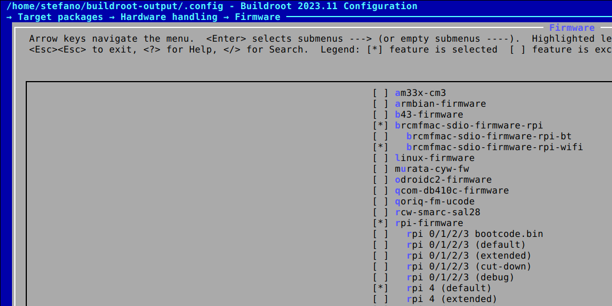
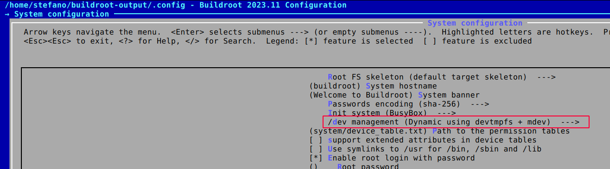
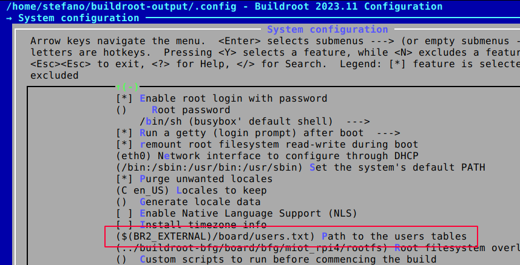

Enable wireless network (and SSH access) on a minimal Linux for the Raspberry Pi 4.

## Introduction

On each board Buildroot ships configuration for, only *eth0* is configured by default. The Raspberry Pi boards, on the other hand, are generally capable of wireless connectivity.  
Trying to enable *wlan0* proved not to be so straight forward, as many of the articles I've found are now a bit outdated. But eventually it boils down to few little settings.

## TL;DR

Jump to the configuration file already: [rpi4_wifi_defconfig](https://github.com/cooked/buildroot-ext/blob/master/configs/rpi4_wifi_defconfig)

## RPI firmware

TODO: On top of the default buildroot (2023.11) config, the following settings enabled the wifi:

```bash
BR2_PACKAGE_BRCMFMAC_SDIO_FIRMWARE_RPI=y
BR2_PACKAGE_BRCMFMAC_SDIO_FIRMWARE_RPI_WIFI=y
BR2_PACKAGE_RPI_FIRMWARE=y
BR2_PACKAGE_RPI_FIRMWARE_VARIANT_PI4=y
```

[](../assets/img/buildroot-rpi/buildroot-rpi-firmware.png)

The **brcmfmac** drivers alone however, will not get us quite there. If you try to build and run the system now, it will show no dmesg about the driver.  

## Enable MDEV

As described in [this post](https://rohitsw.wordpress.com/2016/12/17/building-a-linux-filesystem-on-raspberry-pi-3/) the WiFi components on the Pi come up a little late, so we need to modprobe the WiFi driver **brcmfmac**, manually, or use an hotplug mechanism that would automate that: enter [MDEV](https://git.busybox.net/busybox/tree/docs/mdev.txt).

- **System Configurations -> /dev management -> Dynamic using Devtmpfs + mdev**  

will set the following value:

```bash
BR2_ROOTFS_DEVICE_CREATION_DYNAMIC_MDEV=y
```

[](../assets/img/buildroot-rpi/buildroot-rpi-mdev.png)

For some more insights refer to [6.2. /dev management](https://buildroot.org/downloads/manual/manual.html#_dev_management).

## Network packages

```bash
# network interfaces manager
BR2_PACKAGE_IWD=y

# SSH support
BR2_PACKAGE_DROPBEAR=y
```

Here iwd is preferred to the wpa_supplicant, since it works pretty much out-of-the-box with a simple rootfs overlay:

```bash
# /var/lib/iwd/<MyWifiSSID>.psk

[Security]
Passphrase=<MyWifiPassword>
```

## Custom user

The Buildroot manual describes how to add custom users, besides "root", in [9.6. Adding custom user accounts](https://buildroot.org/downloads/manual/manual.html#customize-users).
A user(table) file that defines the standard Raspberry Pi user looks like this:

```bash
pi -1 pi -1 =raspberry /home/pi /bin/sh -

```

Then the user file must be added to the configuration:

```bash
BR2_ROOTFS_USERS_TABLES="$(BR2_EXTERNAL)/board/users.txt"
```

[](../assets/img/buildroot-rpi/buildroot-rpi-users.png)

**Watch out!** Each line MUST be terminated and MUST be terminated right, which is each line having a trailing **\n**, and the last line being an empty one.
{: .notice--info}

**Watch out!** The user home folder like for example **/home/pi** is created automatically by Buildroot.
{: .notice--info}

**Watch out!** To make sure the format is correct and no other character are injected, use **nano**, **vi** or another basic editor.
{: .notice--info}

## References

- [Rohit's Rants - Building a Linux Filesystem on Raspberry Pi 3](https://rohitsw.wordpress.com/2016/12/17/building-a-linux-filesystem-on-raspberry-pi-3/) : notes about using MDEV and adding RPI firmware. A lot of the other settings apart from that are not useful as of today (November 2023). Also, wpa_supplicant which requires few more steps than **iwd**, seems outdated. 
- [Raspberry Pi Forum - Enabling wlan on Raspberry Pi 3 custom linux](https://forums.raspberrypi.com/viewtopic.php?t=159034) : forum thread with the link to the previous blog
- [SO - How to connect to Wifi on start-up using Buildroot?](https://stackoverflow.com/questions/71426700/how-to-connect-to-wifi-on-start-up-using-buildroot) : hint on using **iwd** in place of wpa_supplicant

- http://lists.busybox.net/pipermail/buildroot/2017-October/204137.html : thread about user table 