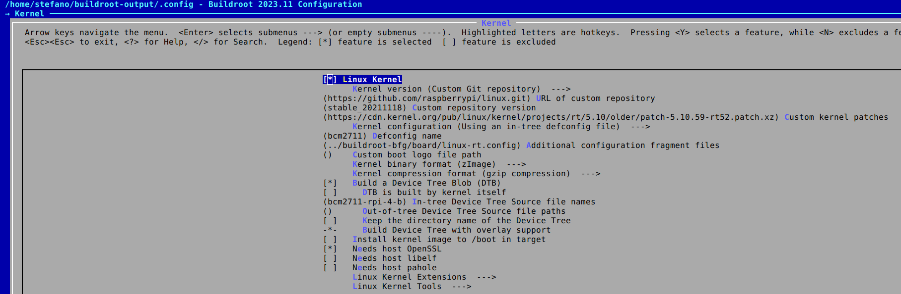

How to use Buildroot to build a minimal Linux system with fully preemptible kernel.

## Introduction

Many times in the past I found myself in need of a real-time-capable system. Being that for work or spare time projects it didn't matter, the goal was always to find a quick, automatable and reproducible way to such RT Linux kernel. 
Fast-forward 2023 and I got something worth writing a post for. Since I will jump to another project too soon, these notes are here also for my own future reference.

## TL;DR

Jump to the configuration file already: [rpi4_5.10_rt_defconfig](https://github.com/cooked/buildroot-ext/blob/master/configs/rpi4_5.10_rt_defconfig)

## Set up Buildroot

The setup steps (and a shortlist of useful commands) are covered in a previous blogpost, [Buildroot basics]()

## Kernel RT

TODO: Full preemptible kernal (PREEMPT_RT) can be built  

```bash
BR2_LINUX_KERNEL_CUSTOM_GIT=y
BR2_LINUX_KERNEL_CUSTOM_REPO_URL="https://github.com/raspberrypi/linux.git"
BR2_LINUX_KERNEL_CUSTOM_REPO_VERSION="stable_20211118"
BR2_LINUX_KERNEL_PATCH="https://cdn.kernel.org/pub/linux/kernel/projects/rt/5.10/older/patch-5.10.59-rt52.patch.xz"
BR2_LINUX_KERNEL_DEFCONFIG="bcm2711"
BR2_LINUX_KERNEL_CONFIG_FRAGMENT_FILES="../buildroot-bfg/board/linux-rt.config"
```



Also align the toolchain header files:

```bash
BR2_PACKAGE_HOST_LINUX_HEADERS_CUSTOM_5_10=y
```


### Default buildroot raspberrypi4_defconfig 


## References

- [SO - How to grep commits based on a certain string?](https://stackoverflow.com/questions/1337320/how-to-grep-commits-based-on-a-certain-string)
- [SO - How to find a commit by its hash?](https://stackoverflow.com/questions/14167335/how-to-find-a-commit-by-its-hash)
