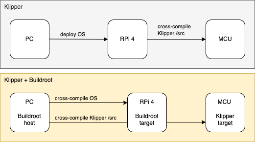
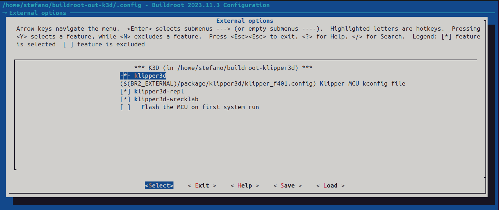
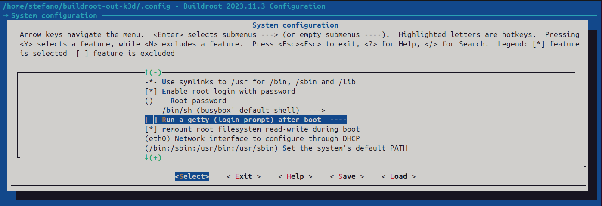
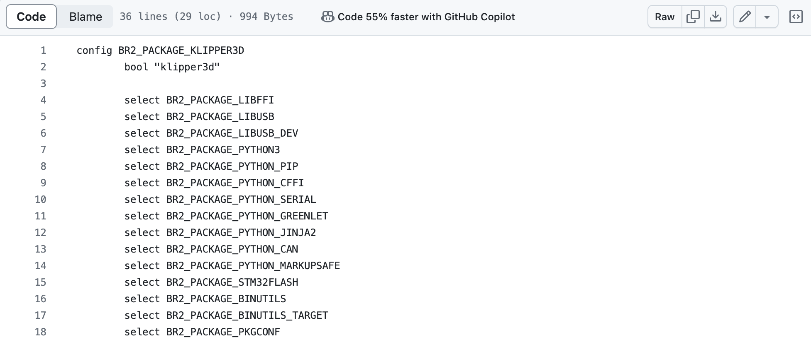
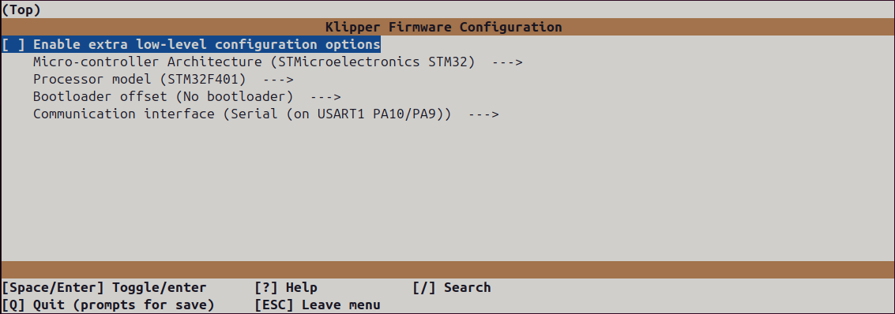

This post describes the work behind [buildroot-klipper3d](https://github.com/cooked/buildroot-klipper3d), a package of the popular 3D printing stack [Klipper](https://www.klipper3d.org/) for Buildroot.

## TL;DR

Check out the [buildroot-klipper3d](https://github.com/cooked/buildroot-klipper3d/tree/master/configs) project on GitHub.

## Overview

[Klipper](https://www.klipper3d.org/) is a control firmware that takes a slightly different approach compared to others, splitting the workload between a SBC (typically less resource contrained), in charge of all the heavy load computation and a MCU board, tasked with the generation of the low-level signals to the actuator and from the sensors.

[Klipper installation](https://www.klipper3d.org/Installation.html) is typically done on top of [OctoPi](https://octoprint.org/download/), a popular Raspbian based SD card image for the Raspberry Pi that already includes the web interface for 3D printers [OctoPrint](https://octoprint.org/).
Alternatively Klipper comes pre-packaged within a purposedly built Linux-based distribution like [MainsailOS](https://docs-os.mainsail.xyz/), along with the Moonraker API server and interfaces like [Mainsail](https://docs.mainsail.xyz/) or [Fluidd](https://docs.fluidd.xyz/).

[Buildroot](https://buildroot.org/), on the other hand, is a simple, efficient and easy-to-use tool to generate embedded Linux systems through cross-compilation. It is based on a kernel-like configuration interface ([menuconfig](https://en.wikipedia.org/wiki/Menuconfig) and alike), relies only on the well-known [Makefile](https://www.gnu.org/software/make/manual/make.html) language and has a simple structure that makes it easy to understand and extend.

No other Klipper package exists for Buildroot, although the topic has been discussed before on Klipper's [GitHub](https://github.com/Klipper3d/klipper/issues/2041) and [Discourse](https://klipper.discourse.group/t/can-i-successfully-port-klipper-to-the-general-arm-linux-system-rather-than-the-current-ubuntu-and-debian-systems/5744/8).

## Implementation

Normally, Klipper installation includes the following steps:
- [prepare an OS image](https://www.klipper3d.org/Installation.html#prepping-an-os-image), running a [script](https://github.com/Klipper3d/klipper/blob/master/scripts/install-debian.sh) that will download Klipper install dependencies, set Python venv and setup Klipper to run at system startup

- [build the MCU firmware](https://www.klipper3d.org/Installation.html#building-and-flashing-the-micro-controller) (kconfig)
- [flash the MCU firmware](https://www.klipper3d.org/Installation.html#building-and-flashing-the-micro-controller)
- [Configuring Klipper](https://www.klipper3d.org/Installation.html#configuring-klipper) (printer config)
- additionally, a mechanism exists within Klipper that builds Klipper [host (klippy) C code](https://github.com/Klipper3d/klipper/tree/master/klippy/chelper) at run time, every time it's needed

Integrating Klipper into the Buildroot build system means to create a *package* with the proper **Makefile** and **Kconfig file** capable of performing all the steps described above (see [klipper3d package](https://github.com/cooked/buildroot-klipper3d/tree/master/package/klipper3d))

The following sections describe the key aspects of this implementation.

### Multiple cross-compile: a tale of two targets

The picture below shows the difference between the traditional Klipper installation workflow and the Buildroot workflow.
Buildroot is responsible for two main task:
- cross-compile the Linux system for the Raspberry Pi (Buildroot's target)
- cross-compile the Klipper firmware for the MCU (Klipper's target)  
  
  
*Klipper default workflow vs Buildroot workflow*

### Buildroot configuration

Starting from the default [raspberrypi4_defconfig](https://github.com/buildroot/buildroot/blob/master/configs/raspberrypi4_defconfig) a number of changes have been introduced, in [raspberrypi4_klipper3d_defconfig](https://github.com/cooked/buildroot-klipper3d/tree/master/configs), to build and run Klipper successfully.

1. an explicit Buildroot version, pre 2024, is needed due to a problem found in later versions where it's not possible to disable the ECHO of the Raspberry onboard serial port

2. enable the [Raspberry Pi onboard UART](https://raspberrypi.stackexchange.com/questions/45570/how-do-i-make-serial-work-on-the-raspberry-pi3-pizerow-pi4-or-later-models) and:
    - configure it as a *full UART* (compare default and [new](https://github.com/cooked/buildroot-klipper3d/blob/master/board/raspberrypi/config_4_uart0.txt) config.txt file)
    - disable any console running on the serial (see [default](https://github.com/buildroot/buildroot/blob/master/board/raspberrypi/cmdline.txt) and [new](https://github.com/cooked/buildroot-klipper3d/blob/master/board/raspberrypi/cmdline_noconsole.txt) cmdline.txt)
    - disable “Run Getty console on boot” from Buildroot configuration

3. the [GNU ARM Embedded Toolchain 10.3-2021.10](https://developer.arm.com/downloads/-/gnu-rm) (pre 2022, and now deprecated) is added as a dependency to compiler Klipper firmware successfully, as building with later toolchain version will [trigger an error](https://github.com/cooked/buildroot-klipper3d/issues/2).

3. Klipper dependencies are added to the [Config.in](https://github.com/cooked/buildroot-klipper3d/blob/master/package/klipper3d/Config.in) file

4. Python 3 is used to run Klipper and the [klippy-requirements](https://github.com/Klipper3d/klipper/blob/master/scripts/klippy-requirements.txt) are once again taken care of in the [Config.in](https://github.com/cooked/buildroot-klipper3d/blob/master/package/klipper3d/Config.in) file

  
*Klipper menuconfig*

  
*Disable getty from the serial console*

  
*Klippy dependencies*

**ONBOARD UART** - Point 1 and 2 are needed if your control board is connected to the Raspberry Pi via the onboard serial port on the GPIO connector. They might be unnecessary when using an USB to serial adapter.
{: .notice--info}


### Klipper firmware configuration

Klipper MCU configuration can be reached within the Buildroot build system:

```bash
make klipper3d-menuconfig
```



## Additional packages

### klipper-repl

klipper-repl has also been [ported to Buildroot](https://github.com/cooked/buildroot-klipper3d/tree/master/package/klipper3d-repl) to provide a minimal interface to control Klipper from the command line.

### KlipperScreen

The porting of [KlipperScreen](https://klipperscreen.readthedocs.io/en/latest/) is PLANNED.

### klipper-wrecklab

[klipper-wrecklab](https://github.com/cooked/buildroot-klipper3d/tree/master/package/klipper3d-wrecklab) is a package that adds support for the [printHAT control boards](https://docs.wrecklab.com/) from Wrecklab.

## Not supported

[Moonraker](https://github.com/Arksine/moonraker) API server is not currently supported as its installation depends on the standard [**ip** command](https://man7.org/linux/man-pages/man8/ip.8.html) that can output data in json format.
BusyBox, on which Buildroot is based, provides its [own ip command](https://linux.die.net/man/1/busybox) that does not include the option for JSON output.

As a consequence [Mainsail](https://docs.mainsail.xyz/), which relies on the Moonraker server, is also not supported.
